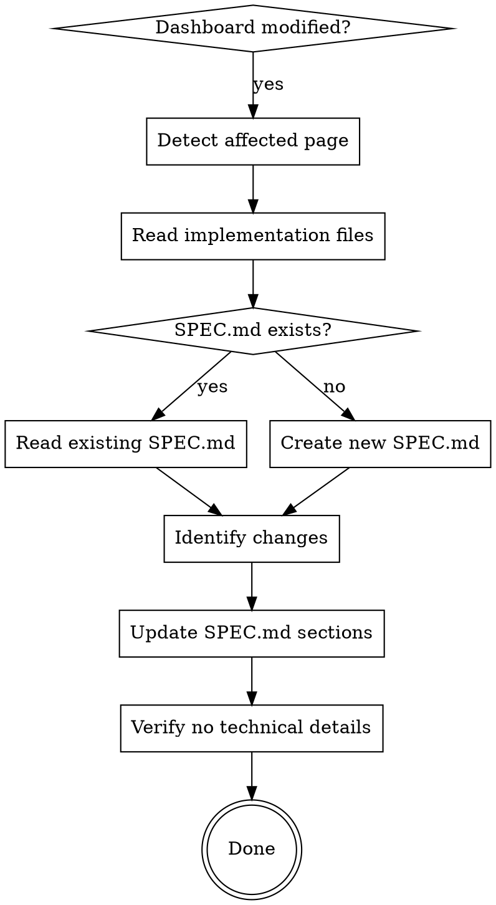

# Dash SPEC.md Updater

## Overview

Updates user-facing SPEC.md documentation when Plotly Dash dashboards change. SPEC.md explains what dashboards do (for users), not how they work (technical).

**Core principle:** Every dashboard modification requires SPEC.md update. No exceptions.

## When to Use

Use when:
- Adding/modifying filters, charts, KPIs, or tables in src/pages/*/
- Creating new dashboard pages
- User requests dashboard changes
- At end of dash-bi-workflow

**Triggering symptoms:**
- Modified _layout.py, _callbacks.py, or _constants.py
- Added new components to dashboard
- Changed chart types or data sources

## Mandatory Workflow



## Implementation

### 1. Detect Affected Dashboard

```bash
# Find recently modified pages
find src/pages/ -type f -name "*.py" -mtime -1
```

Look for: `src/pages/<page_name>/`

### 2. Read Implementation Files

For each affected dashboard, read:
- `_constants.py` - Dataset IDs, component IDs, column maps
- `_layout.py` - Filter components, charts, KPIs, tables
- `_callbacks.py` - Data transformations (to understand what filters/charts do)

### 3. Identify Changes

Extract from implementation:
- **Filters**: Component IDs matching `FILTER_ID_*` in _constants.py
- **KPIs**: Component IDs matching `KPI_ID_*` or `CHART_ID_KPI_*`
- **Charts**: Component IDs matching `CHART_ID_*`
- **Data sources**: `DATASET_ID` constants

### 4. Update SPEC.md Sections

**Required structure** (日本語):

```markdown
# <ダッシュボード名>

## 概要
このダッシュボードの目的を1-2文で説明

## データソース
- dataset-id データセット

## フィルタの使い方
### <フィルタ名>
何を絞り込めるかの説明

## KPIカード (該当する場合のみ)
### <KPI名>
この指標が何を意味するか

## チャート・テーブルの見方
### <チャート名>
何が表示されるか、どう解釈するか
```

### 5. Verify: No Technical Details

**FORBIDDEN in SPEC.md:**
- Component IDs (cu-filter-date, apac-dot-kpi-*)
- Column mappings (COLUMN_MAP)
- Callback logic
- Python code
- Implementation details

**REQUIRED in SPEC.md:**
- User-facing explanations (日本語)
- What filters/charts DO (not how they work)
- How to interpret results

## Counter-Rationalizations

| Excuse | Reality |
|--------|---------|
| "急いでいる - later" | 5 minutes includes SPEC.md. Update now or forget. |
| "Just a small fix" | Small fixes = small SPEC updates. Takes 30 seconds. |
| "Authority said skip docs" | SPEC.md IS part of deliverable. Critical thinking required. |
| "Already modified 5 files" | Sunk cost = 5 files. 6th file (SPEC.md) completes the work. |
| "SPEC.md doesn't exist" | Create it. Use template above. |

**Red flags - STOP and update SPEC.md:**
- Modified dashboard without mentioning SPEC.md
- "I'll document later"
- Completed implementation without docs
- User said "quick fix"

## SPEC.md Template

For new dashboards:

```markdown
# <Dashboard Name>

## 概要
<このダッシュボードの目的を1-2文で>

## データソース
- <dataset-id> データセット

## フィルタの使い方

### <フィルタ1>
<絞り込める内容>

### <フィルタ2>
<絞り込める内容>

## チャート・テーブルの見方

### <チャート1>
<表示内容と解釈方法>

### <チャート2>
<表示内容と解釈方法>
```

## Common Mistakes

**Mistake 1: Including technical details**
```markdown
❌ BAD:
### Date Filter
Component ID: cu-filter-date
Maps to COLUMN_MAP["date"] = "Date"

✅ GOOD:
### 日付範囲
利用データの対象期間を指定できます。
```

**Mistake 2: Skipping SPEC.md when "urgent"**
```
❌ BAD: Implement filter → done
✅ GOOD: Implement filter → update SPEC.md → done
```

**Mistake 3: Creating SPEC.md in English**
```markdown
❌ BAD: ## Overview (English)
✅ GOOD: ## 概要 (日本語)
```

## Integration with dash-bi-workflow

Add as final step in dash-bi-workflow:

```markdown
After implementing dashboard changes:
1. Run tests
2. Verify UI
3. **Update SPEC.md** (use dash-spec-updater skill)
4. Commit changes
```

## Real-World Impact

**Before skill:**
- Inconsistent SPEC.md updates (66% skip rate under time pressure)
- User-facing docs drift from implementation
- New team members confused by dashboards

**After skill:**
- 100% SPEC.md coverage
- Documentation always reflects current state
- Clear user guidance for all dashboards
