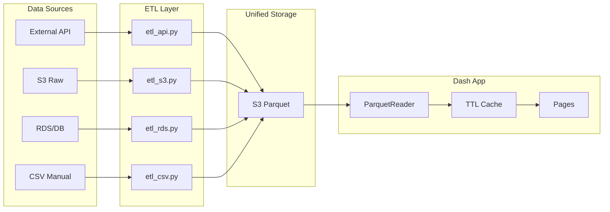
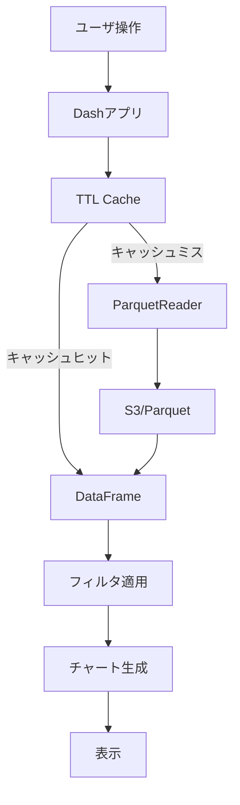
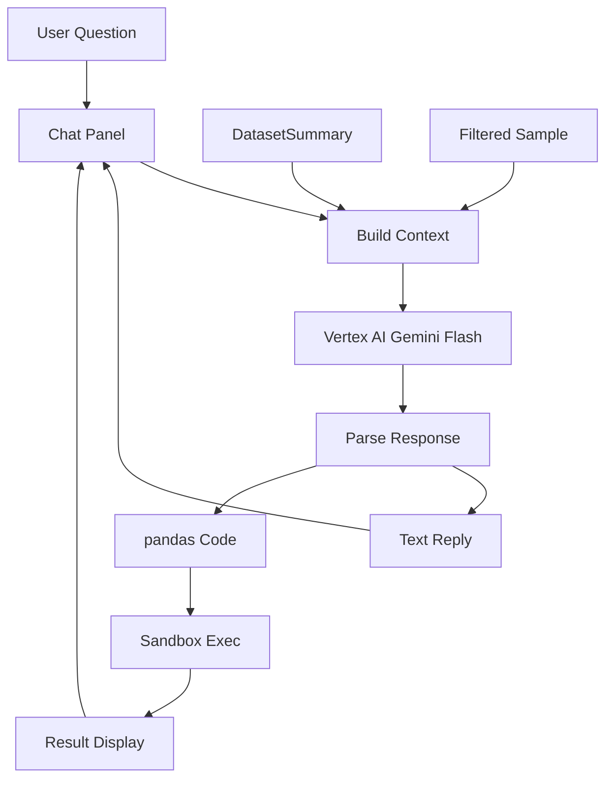

# Plotly Dash BI Dashboard 技術仕様書 v0.2

Last Updated: 2026-02-07

## このドキュメントについて

- 役割: 技術スタック・設定値・データ変換仕様の正式仕様
- 関連: 開発者ガイドは [CONTRIB.md](CONTRIB.md) を参照

## プロダクト概要

Plotly Dash ベースの汎用 BI ダッシュボード。
データソースごとに ETL スクリプトを用意し、S3/Parquet に統一出力。
Dash アプリは S3 のクリーンデータを読んで可視化するだけ。

### フェーズ分割

- Phase 1: ダッシュボード基盤（マルチページ、サイドバー、チャート、フィルタ、キャッシュ、ETL）
- Phase 2: LLM 質問機能（Vertex AI 連携、チャットパネル、サンドボックス実行）
- Phase 3: 本番認証（SAML）、ロール管理

---

## 1. 技術スタック

### 1.1 アプリケーション

| 項目 | 技術 | バージョン | 理由 |
|------|------|-----------|------|
| フレームワーク | Plotly Dash | >=2.14.0 | インタラクティブダッシュボード |
| UIコンポーネント | Dash Bootstrap Components | >=1.5.0 | Bootstrap統合 |
| 認証（ローカル） | Flask-Login | >=0.6.3 | フォームログイン（FormAuthProvider） |
| 認証（本番） | SAML | - | 会社の IdP と連携（Phase 3） |
| 言語 | Python | 3.9+ | 安定性、パフォーマンス |
| DataFrame | Pandas | >=2.0.0 | 標準的 |
| Parquet | PyArrow | >=14.0.0 | 高速、メモリ効率 |
| S3 | boto3 | >=1.34.0 | AWS SDK |
| 可視化 | Plotly | >=5.0.0 | インタラクティブグラフ |
| ログ | structlog | >=23.0.0 | 構造化ログ |
| キャッシュ | flask-caching | >=2.0.0 | TTL キャッシュ（SimpleCache, 300秒） |
| LLM（Phase 2） | Vertex AI SDK | - | Gemini Flash |

### 1.3 アーキテクチャ

- ダッシュボード定義: Python コードで管理（GUI ビルダーではない）
- ページ構成: ページごとに自由に定義（データセット数もチャート構成もページごとに異なる）
- ナビゲーション: 左サイドバー (Metabase / Redash 風)
- デプロイ先: AWS ECS / Fargate
- ローカル開発: Docker + docker-compose + MinIO

### 1.2 ローカル開発

| 項目 | 技術 | バージョン |
|------|------|-----------|
| コンテナ | Docker | 24.x |
| オーケストレーション | docker-compose | 2.x |
| S3互換 | MinIO | latest |

### 1.4 ETL レイヤー

- ETL はデータソースごとに独立した Python ファイル
- ETL のスケジューリング: cron / systemd timer
- ETL の出力先: 全て S3/Parquet に統一
- Dash アプリは S3 のみ参照

データソース例:
- External API → `etl_api.py`
- S3 Raw → `etl_s3.py`
- RDS/DB → `etl_rds.py`
- CSV Manual → `etl_csv.py`

---

## 2. 設定値

### 2.1 環境変数

```bash
# S3
S3_ENDPOINT=http://localhost:9000  # ローカルのみ（MinIO）
S3_REGION=ap-northeast-1
S3_BUCKET=bi-datasets
S3_ACCESS_KEY=minioadmin  # ローカルのみ
S3_SECRET_KEY=minioadmin  # ローカルのみ

# 認証（ローカル開発）
BASIC_AUTH_USERNAME=admin
BASIC_AUTH_PASSWORD=changeme

# Vertex AI（Phase 2）
# GOOGLE_APPLICATION_CREDENTIALS=/path/to/service-account.json
# VERTEX_AI_PROJECT=your-project-id
# VERTEX_AI_LOCATION=asia-northeast1
```

---

## 3. データ変換仕様

### 3.1 CSV → Parquet変換

型推論ルール:

| CSVデータパターン | 推論される型 |
|------------------|------------|
| 整数のみ（-999〜999...） | int64 |
| 小数を含む数値 | float64 |
| true/false/True/False/1/0 | bool |
| ISO 8601日付（YYYY-MM-DD） | date |
| ISO 8601日時（YYYY-MM-DDTHH:MM:SS） | datetime |
| 上記以外 | string |

変換オプション:

```python
@dataclass(frozen=True)
class CsvImportOptions:
    encoding: Optional[str] = None  # utf-8, shift_jis, cp932
    delimiter: str = ","
    has_header: bool = True
    null_values: list[str] = ["", "NULL", "null", "NA", "N/A"]
```

エンコーディング検出:

- 先頭10KBで `chardet` を使用して自動検出
- 日本語エンコーディングの補正:
  - `ascii` → `utf-8`
  - `ISO-8859-1`, `Windows-1252` → `cp932`（日本語の場合）

### 3.2 パーティション仕様

パーティション分割:
- 日付カラムが指定された場合、日単位でパーティション
- パーティションキー: `YYYY-MM-DD`
- パーティションなしの場合、単一Parquetファイル

S3パス構造:

```
datasets/{datasetId}/
  data/                    # パーティションなし
    part-0000.parquet
  partitions/              # パーティションあり
    date=2024-01-01/
      part-0000.parquet
    date=2024-01-02/
      part-0000.parquet
```

### 3.3 フィルタ適用ロジック

カテゴリフィルタ:

```python
# 単一選択
df = df[df[column] == value]

# 複数選択
df = df[df[column].isin(values)]

# NULL許容
if include_null:
    df = df[(df[column].isin(values)) | (df[column].isna())]
```

日付フィルタ:

```python
# 期間フィルタ（境界を含む）
df = df[(df[column] >= start_date) & (df[column] <= end_date)]

# パーティションプルーニング
# 日付フィルタがある場合、該当パーティションのみ読み込み
partitions_to_read = [
    p for p in all_partitions
    if start_date <= p.date <= end_date
]
```

日付境界ルール:
- 開始日: 00:00:00 から（含む）
- 終了日: 23:59:59 まで（含む）
- タイムゾーン: JST（Asia/Tokyo）固定

---

## 4. チャートテンプレート

### 4.1 利用可能なチャートタイプ

| タイプ | 名前 | 説明 | パラメータ |
|--------|------|------|-----------|
| summary-number | Summary Number | 大きな数字表示 | `value_column`, `agg_func` (sum/mean/count/max/min) |
| bar | Bar Chart | 棒グラフ | `x_column`, `y_column` |
| line | Line Chart | 折れ線グラフ | `x_column`, `y_column` |
| pie | Pie Chart | 円グラフ | `names_column`, `values_column` |
| table | Table | テーブル表示 | （なし） |
| pivot | Pivot Table | ピボットテーブル | `index_column`, `columns_column` (optional), `values_column`, `agg_func` |

### 4.2 チャートテンプレートの使い方

```python
from src.charts.templates import get_chart_template

# チャートタイプを取得
template = get_chart_template("bar")

# データセットとパラメータを指定してレンダリング
figure = template["render"](
    dataset=df,
    filters=None,
    params={"x_column": "category", "y_column": "amount"}
)

# Dashコンポーネントに配置
dcc.Graph(figure=figure)
```

---

## 5. データフロー

### 5.1 全体データフロー



### 5.2 データセット読み込みフロー



### 5.3 キャッシュ仕様

- TTL キャッシュ: メモリ上にデータを保持し、一定時間（例: 5分）は再利用
- キャッシュキー: `dataset_id` + フィルタパラメータ
- キャッシュ切れ時に S3 から再読み込み

### 5.4 データセット一覧取得

```python
from src.data.parquet_reader import ParquetReader

reader = ParquetReader()
datasets = reader.list_datasets()  # S3のdatasets/配下をスキャン
```

### 5.5 データセット読み込み

```python
from src.data.parquet_reader import ParquetReader

reader = ParquetReader()
df = reader.read_dataset(dataset_id)  # datasets/{id}/data/part-0000.parquet を読み込み
```

### 5.6 データセット統計生成

```python
from src.data.dataset_summarizer import DatasetSummarizer
from src.data.parquet_reader import ParquetReader

reader = ParquetReader()
summarizer = DatasetSummarizer(reader)
summary = summarizer.generate_summary(dataset_id)

# summary には以下が含まれる:
# - schema: カラム定義（name, dtype, nullable）
# - statistics: 列ごとの統計（min, max, mean, std, unique_count, top_values等）
# - row_count: 行数
# - column_count: 列数
```

---

## 6. エラーハンドリング

### 6.1 カスタム例外

```python
from src.exceptions import DatasetFileNotFoundError

# S3にParquetファイルが存在しない場合
raise DatasetFileNotFoundError(s3_path="datasets/xxx/data/part-0000.parquet", dataset_id="xxx")
```

### 6.2 エラーレスポンス

Dashアプリでは、エラーはコールバック内でキャッチしてエラーメッセージを表示する。

```python
@callback(
    Output("data-preview", "children"),
    Input("dataset-dropdown", "value"),
)
def update_preview(dataset_id):
    try:
        reader = ParquetReader()
        df = reader.read_dataset(dataset_id)
        return dash_table.DataTable(...)
    except DatasetFileNotFoundError:
        return html.P("データセットが見つかりません", className="text-danger")
    except Exception as e:
        return html.P(f"エラー: {str(e)}", className="text-danger")
```

---

## 7. ログ仕様

### 7.1 ログ形式（JSON）

```json
{
  "timestamp": "2024-01-15T10:30:00.000Z",
  "level": "INFO",
  "logger": "src.data.parquet_reader",
  "message": "Dataset loaded",
  "dataset_id": "ds_123"
}
```

### 7.2 ログレベル

| レベル | 用途 |
|--------|------|
| ERROR | エラー、例外 |
| WARN | 警告（リトライ成功等） |
| INFO | 通常操作（データセット読み込み等） |
| DEBUG | デバッグ情報（ローカルのみ） |

### 7.3 ログ設定

```python
from src.core.logging import setup_logging

# アプリ起動時に呼び出す
setup_logging()
```

---

## 8. セキュリティ

### 8.1 認証方式

#### ローカル開発: Flask-Login フォーム認証

Flask-Login + FormAuthProvider を使用:

```python
from src.auth.flask_login_setup import init_login_manager
from src.auth.login_callbacks import register_login_callbacks
from src.auth.layout_callbacks import register_layout_callbacks

app = Dash(__name__, use_pages=True)
app.server.config["SECRET_KEY"] = settings.secret_key
init_login_manager(app.server)
register_login_callbacks(app)
register_layout_callbacks(app)
# .env の BASIC_AUTH_USERNAME / BASIC_AUTH_PASSWORD で認証
```

#### 本番環境: SAML認証（Phase 3）

- 会社の IdP と連携
- 実装方式は後続の設計フェーズで決定 (Cognito + SAML / ALB OIDC 等)

### 8.2 権限管理（Phase 3）

- 管理者 / 閲覧者 のロール分け想定
- ページ単位でのアクセス制御

### 8.3 S3アクセス制御

- ローカル開発: MinIOのデフォルト認証情報（minioadmin/minioadmin）
- 本番環境: IAMロールまたはアクセスキーで制御

---

## 9. テスト戦略

### 9.1 テストレベル

| レベル | カバレッジ目標 | ツール |
|--------|--------------|--------|
| 単体テスト | 80% | pytest |

### 9.2 テストデータ

モック:
- S3: moto または unittest.mock

### 9.3 テスト実行

テスト実行方法の詳細は [CONTRIB.md](CONTRIB.md) sec.5 を参照。

---

## 10. 開発ツール設定

### 10.1 Ruff設定

`pyproject.toml`:

```toml
[tool.ruff]
line-length = 100
target-version = "py39"
```

### 10.2 mypy設定

`pyproject.toml`:

```toml
[tool.mypy]
python_version = "3.9"
strict = true
allow_untyped_calls = true
allow_untyped_defs = true
```

### 10.3 pytest設定

`pyproject.toml`:

```toml
[tool.pytest.ini_options]
asyncio_mode = "auto"
testpaths = ["tests"]
```

---

## 11. LLM 質問機能 (Phase 2)

ダッシュボードに表示中のデータについて、LLM に質問して深掘りできる機能。

### 11.1 基本仕様

- モデル: Gemini Flash (Vertex AI) -- コスト重視
- UI: 右サイドパネルにチャット UI（トグルで開閉）
- 会話履歴: セッション中のみ保持（ページ遷移/リロードで消える）
- コスト管理: 制限なし（チーム内利用のため）

### 11.2 LLM に渡すコンテキスト

- DatasetSummary（スキーマ、統計情報、行数・列数）
- フィルタ適用後のサンプルデータ

### 11.3 LLM の出力

- テキスト回答（分析コメント、示唆）
- pandas コード生成 + サンドボックス実行 + 結果表示

### 11.4 コード実行の安全策

- サンドボックス実行（制限付き exec）
- 許可する操作を限定（ファイルシステムアクセス、ネットワーク呼び出し等は禁止）
- 許可する pandas 操作の一覧は実装時に決定

### 11.5 データフロー



### 11.6 実装時の設計判断

- LLM サンドボックスの具体的な制限範囲（許可する pandas 操作の一覧）
- LLM へのプロンプトテンプレート設計
- Vertex AI SDK の認証方式（サービスアカウント / ADC）
