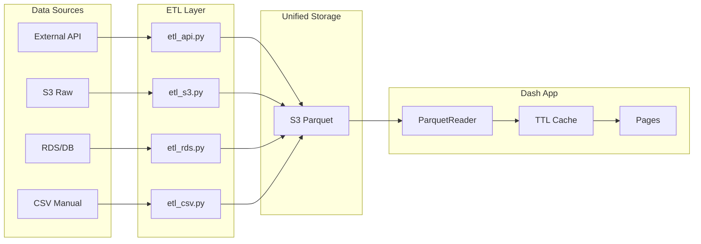
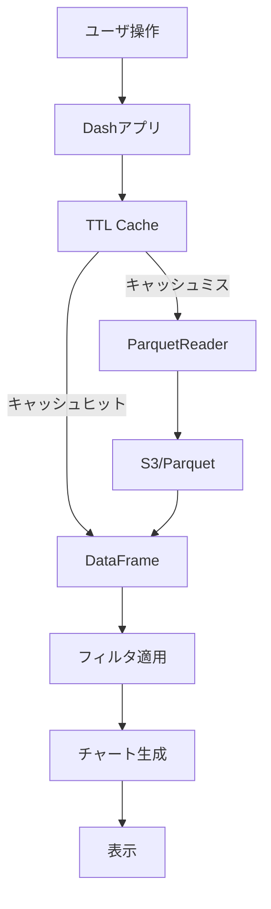
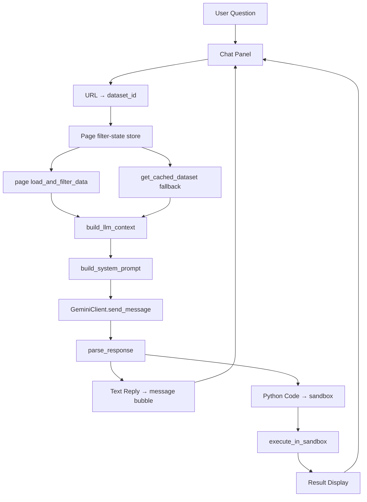

# Plotly Dash BI Dashboard 技術仕様書 v0.2

Last Updated: 2026-02-11

## このドキュメントについて

- 役割: 技術スタック・設定値・データ変換仕様の正式仕様
- 関連: 開発者ガイドは [CONTRIB.md](CONTRIB.md) を参照

## プロダクト概要

Plotly Dash ベースの汎用 BI ダッシュボード。
データソースごとに ETL スクリプトを用意し、S3/Parquet に統一出力。
Dash アプリは S3 のクリーンデータを読んで可視化するだけ。

### フェーズ分割

- Phase 1: ダッシュボード基盤（マルチページ、サイドバー、チャート、フィルタ、キャッシュ、ETL）
- Phase 2: LLM 質問機能（Vertex AI 連携、チャットパネル、サンドボックス実行）
- Phase 3: 本番認証（SAML）、ロール管理

---

## 1. 技術スタック

### 1.1 アプリケーション

| 項目 | 技術 | バージョン | 理由 |
|------|------|-----------|------|
| フレームワーク | Plotly Dash | >=4.0.0 | インタラクティブダッシュボード |
| UIコンポーネント | Dash Bootstrap Components | >=1.5.0 | Bootstrap統合 |
| 認証（ローカル） | Flask-Login | >=0.6.3 | フォームログイン（FormAuthProvider） |
| 認証（本番） | SAML | - | 会社の IdP と連携（Phase 3） |
| 言語 | Python | 3.11+ | 安定性、パフォーマンス |
| DataFrame | Pandas | >=2.0.0 | 標準的 |
| Parquet | PyArrow | >=14.0.0 | 高速、メモリ効率 |
| S3 | boto3 | >=1.34.0 | AWS SDK |
| 可視化 | Plotly | >=5.0.0 | インタラクティブグラフ |
| ログ | structlog | >=23.0.0 | 構造化ログ |
| キャッシュ | flask-caching | >=2.0.0 | TTL キャッシュ（SimpleCache, 3600秒） |
| LLM（Phase 2） | google-genai | >=1.0.0 | Gemini 2.0 Flash（API key認証） |

### 1.3 アーキテクチャ

- ダッシュボード定義: Python コードで管理（GUI ビルダーではない）
- ページ構成: ページごとに自由に定義（データセット数もチャート構成もページごとに異なる）
- ナビゲーション: 左サイドバー (Metabase / Redash 風)
- デプロイ先: AWS ECS / Fargate
- ローカル開発: Docker + docker compose + MinIO

### 1.2 ローカル開発

| 項目 | 技術 | バージョン |
|------|------|-----------|
| コンテナ | Docker | 24.x |
| オーケストレーション | docker compose (v2) | 2.x |
| S3互換 | MinIO | latest |

### 1.4 ETL レイヤー

- ETL はデータソースごとに独立した Python ファイル
- ETL のスケジューリング: cron / systemd timer
- ETL の出力先: 全て S3/Parquet に統一
- Dash アプリは S3 のみ参照

データソース例:
- External API → `etl_api.py`
- S3 Raw → `etl_s3.py`
- RDS/DB → `etl_rds.py`
- CSV Manual → `etl_csv.py`

---

## 2. 設定値

### 2.1 環境変数

環境変数の詳細な一覧と設定方法は [CONTRIB.md](CONTRIB.md) セクション4 を参照。

主要な環境変数:
- S3接続: `S3_ENDPOINT`, `S3_BUCKET`, `S3_ACCESS_KEY`, `S3_SECRET_KEY`
- 認証: `BASIC_AUTH_USERNAME`, `BASIC_AUTH_PASSWORD`
- DOMO ETL: `DOMO_CLIENT_ID`, `DOMO_CLIENT_SECRET`
- マスキング: `ETL_MASKING_SECRET`

---

## 3. データ変換仕様

### 3.1 CSV → Parquet変換

型推論ルール:

| CSVデータパターン | 推論される型 |
|------------------|------------|
| 整数のみ（-999〜999...） | int64 |
| 小数を含む数値 | float64 |
| true/false/True/False/1/0 | bool |
| ISO 8601日付（YYYY-MM-DD） | date |
| ISO 8601日時（YYYY-MM-DDTHH:MM:SS） | datetime |
| 上記以外 | string |

変換オプション:

```python
@dataclass(frozen=True)
class CsvImportOptions:
    encoding: Optional[str] = None  # utf-8, shift_jis, cp932
    delimiter: str = ","
    has_header: bool = True
    null_values: list[str] = field(default_factory=list)  # デフォルトは空リスト（pandasのデフォルトnull解釈を使用）
```

エンコーディング検出:

- 先頭10KBで `chardet` を使用して自動検出
- 日本語エンコーディングの補正:
  - `ascii` → `utf-8`
  - `ISO-8859-1`, `Windows-1252` → `cp932`（日本語の場合）

### 3.2 パーティション仕様

パーティション分割:
- 日付カラムが指定された場合、日単位でパーティション
- パーティションキー: `YYYY-MM-DD`
- パーティションなしの場合、単一Parquetファイル

S3パス構造:

```
datasets/{datasetId}/
  data/                    # パーティションなし
    part-0000.parquet
  partitions/              # パーティションあり
    date=2024-01-01/
      part-0000.parquet
    date=2024-01-02/
      part-0000.parquet
```

### 3.3 フィルタ適用ロジック

カテゴリフィルタ:

```python
# 単一選択
df = df[df[column] == value]

# 複数選択
df = df[df[column].isin(values)]

# NULL許容
if include_null:
    df = df[(df[column].isin(values)) | (df[column].isna())]
```

日付フィルタ:

```python
# 期間フィルタ（境界を含む）
df = df[(df[column] >= start_date) & (df[column] <= end_date)]

# パーティションプルーニング
# 日付フィルタがある場合、該当パーティションのみ読み込み
partitions_to_read = [
    p for p in all_partitions
    if start_date <= p.date <= end_date
]
```

日付境界ルール:
- 開始日: 00:00:00 から（含む）
- 終了日: 23:59:59 まで（含む）
- タイムゾーン: JST（Asia/Tokyo）固定

---

## 4. チャート構築

### 4.1 標準API（推奨）

チャートとテーブルは宣言的Spec（`ChartSpec`, `TableSpec`）とビルダー関数（`build_chart`, `build_table`）を使用して構築する。

#### チャート構築

```python
from src.charts.chart_builder import build_chart
from src.charts.specs import ChartSpec

# ChartSpecを定義
spec = ChartSpec(
    title="売上推移",
    chart_type="bar",  # bar, line, pie, stacked_bar, scatter, area, horizontal_bar
    x_column="date",
    y_columns=["sales"],
    height=400,
    labels={"x": "日付", "y": "売上"},
)

# DataFrameからチャートを生成
figure = build_chart(df, spec)

# Dashコンポーネントに配置
dcc.Graph(figure=figure)
```

#### テーブル構築

```python
from src.charts.table_builder import build_table
from src.charts.specs import (
    TableSpec,
    DEFAULT_STYLE_TABLE,
    DEFAULT_STYLE_CELL,
    DEFAULT_STYLE_HEADER,
)

# TableSpecを定義（デフォルトスタイル定数を使用）
spec = TableSpec(
    title="詳細一覧",
    style_table=DEFAULT_STYLE_TABLE,
    style_cell=DEFAULT_STYLE_CELL,
    style_header=DEFAULT_STYLE_HEADER,
    style_data_conditional=[],
    column_display={"col1": "列1", "col2": "列2"},
    column_order=["col1", "col2"],
    page_size=10,
)

# DataFrameからテーブルを生成
title, table_component = build_table(df, spec)

# Dashコンポーネントに配置
html.Div([
    html.H5(title),
    table_component,
])
```

#### 空状態・エラー状態

```python
from src.charts.empty_states import (
    create_empty_figure,
    create_empty_table,
    create_error_figure,
)

# データがない場合の空状態
empty_fig = create_empty_figure(message="データがありません", height=400)
empty_table = create_empty_table()
error_fig = create_error_figure(message="エラーが発生しました", height=400)
```

### 4.2 利用可能なチャートタイプ

| タイプ | `chart_type` 値 | 説明 |
|--------|----------------|------|
| bar | `"bar"` | 棒グラフ |
| line | `"line"` | 折れ線グラフ |
| pie | `"pie"` | 円グラフ |
| stacked_bar | `"stacked_bar"` | 積み上げ棒グラフ |
| scatter | `"scatter"` | 散布図 |
| area | `"area"` | 面グラフ |
| horizontal_bar | `"horizontal_bar"` | 横棒グラフ |

### 4.3 その他の表示形式

- KPIカード: `src/components/cards.py` の `create_kpi_card()` を使用
- カスタム集計・描画: ページ固有の `_chart_builders.py` で実装（例: `src/pages/apac_dot_due_date/charts/_ch00_reference_table.py`）

### 4.4 レガシーテンプレート（後方互換のため残存）

`src/charts/templates.py` の `render_bar_chart()`, `render_line_chart()`, `render_pie_chart()` 関数は後方互換のため残存しているが、新規実装では使用しないこと。

理由:
- Dash 4.x では `dangerously_allow_html` が廃止され、レガシーラッパーは非推奨
- 新規実装では `build_chart()` + `ChartSpec` を使用すること

### 4.5 表示品質パターン（再利用用）

チャートの見やすさをページ横断で揃える場合は、`ChartSpec` と `_chart_builders.py` 後段調整をセットで使う。

用途別の推奨値:

| 用途 | 推奨 `ChartSpec` | 推奨レイアウト後処理 |
|------|------------------|----------------------|
| 円グラフ（構成比） | `height=460`, `show_legend=True` | `title=None`, `margin`調整, `textinfo="label+value+percent"` |
| 積み上げ棒 | `text_template="%{y}"`, `height=460` | `title=None`, `legend`位置最適化, `textposition="inside"` |
| 単一系列バー | `show_legend=False`, `text_template="%{y}"` | `title=None`, 上余白を詰める |

標準の適用順序（`build_chart()` 後）:
1. タイトル重複を避けるため `fig.update_layout(title={"text": None})`
2. `margin` を調整して描画面積を確保
3. `legend` の表示有無と位置を調整
4. データラベル（`textposition` / `uniformtext`）を調整

`dcc.Graph` 推奨設定:

```python
dcc.Graph(
    id=CHART_ID,
    className="chart-density-graph",
    config={"displayModeBar": False, "responsive": True},
)
```

CSS設計原則:
- `.card` などのグローバルclassを直接変更しない
- セクションclassを起点にスコープする（例: `.chart-density-row .chart-density-card`）
- 余白最適化は `card-body` と `graph` の局所設定で行う

---

## 5. データフロー

### 5.1 全体データフロー


```mermaid
flowchart LR
    subgraph sources [Data Sources]
        API[External API]
        S3src[S3 Raw]
        RDS[RDS/DB]
        CSV[CSV Manual]
    end

    subgraph etl [ETL Layer]
        ETL1[etl_api.py]
        ETL2[etl_s3.py]
        ETL3[etl_rds.py]
        ETL4[etl_csv.py]
    end

    subgraph storage [Unified Storage]
        S3P[S3 Parquet]
    end

    subgraph dash [Dash App]
        Reader[ParquetReader]
        Cache[TTL Cache]
        Pages[Pages]
    end

    API --> ETL1
    S3src --> ETL2
    RDS --> ETL3
    CSV --> ETL4
    ETL1 --> S3P
    ETL2 --> S3P
    ETL3 --> S3P
    ETL4 --> S3P
    S3P --> Reader
    Reader --> Cache
    Cache --> Pages
```

### 5.2 データセット読み込みフロー


```mermaid
flowchart TB
    User[ユーザ操作] --> Dash[Dashアプリ]
    Dash --> Cache[TTL Cache]
    Cache -->|キャッシュヒット| DataFrame[DataFrame]
    Cache -->|キャッシュミス| ParquetReader[ParquetReader]
    ParquetReader --> S3[S3/Parquet]
    S3 --> DataFrame
    DataFrame --> Filter[フィルタ適用]
    Filter --> Chart[チャート生成]
    Chart --> Display[表示]
```

### 5.3 キャッシュ仕様

- TTL キャッシュ: メモリ上にデータを保持し、一定時間（1時間）は再利用
- キャッシュキー: `dataset:{dataset_id}` （フィルタパラメータは含まない）
- フィルタ適用: キャッシュされた全量DataFrameに対してインメモリで適用される
- キャッシュ切れ時に S3 から再読み込み

### 5.4 データセット一覧取得

```python
from src.data.parquet_reader import ParquetReader

reader = ParquetReader()
datasets = reader.list_datasets()  # S3のdatasets/配下をスキャン
```

### 5.5 データセット読み込み

```python
from src.data.parquet_reader import ParquetReader

reader = ParquetReader()
df = reader.read_dataset(dataset_id)  # datasets/{id}/data/part-0000.parquet を読み込み
```

### 5.6 データセット統計生成

```python
from src.data.dataset_summarizer import DatasetSummarizer
from src.data.parquet_reader import ParquetReader

reader = ParquetReader()
summarizer = DatasetSummarizer(reader)
summary = summarizer.generate_summary(dataset_id)

# summary には以下が含まれる:
# - schema: カラム定義（name, dtype, nullable）
# - statistics: 列ごとの統計（min, max, mean, std, unique_count, top_values等）
# - row_count: 行数
# - column_count: 列数
```

---

## 6. エラーハンドリング

### 6.1 カスタム例外

```python
from src.exceptions import DatasetFileNotFoundError

# S3にParquetファイルが存在しない場合
raise DatasetFileNotFoundError(s3_path="datasets/xxx/data/part-0000.parquet", dataset_id="xxx")
```

### 6.2 エラーレスポンス

Dashアプリでは、エラーはコールバック内でキャッチしてエラーメッセージを表示する。

```python
@callback(
    Output("data-preview", "children"),
    Input("dataset-dropdown", "value"),
)
def update_preview(dataset_id):
    try:
        reader = ParquetReader()
        df = reader.read_dataset(dataset_id)
        return dash_table.DataTable(...)
    except DatasetFileNotFoundError:
        return html.P("データセットが見つかりません", className="text-danger")
    except Exception as e:
        return html.P(f"エラー: {str(e)}", className="text-danger")
```

---

## 7. ログ仕様

### 7.1 ログ形式（JSON）

```json
{
  "timestamp": "2024-01-15T10:30:00.000Z",
  "level": "INFO",
  "logger": "src.data.parquet_reader",
  "message": "Dataset loaded",
  "dataset_id": "ds_123"
}
```

### 7.2 ログレベル

| レベル | 用途 |
|--------|------|
| ERROR | エラー、例外 |
| WARN | 警告（リトライ成功等） |
| INFO | 通常操作（データセット読み込み等） |
| DEBUG | デバッグ情報（ローカルのみ） |

### 7.3 ログ設定

```python
from src.core.logging import setup_logging

# アプリ起動時に呼び出す
setup_logging()
```

---

## 8. セキュリティ

### 8.1 認証方式

#### ローカル開発: Flask-Login フォーム認証

Flask-Login + FormAuthProvider を使用:

```python
from src.auth.flask_login_setup import init_login_manager
from src.auth.login_callbacks import register_login_callbacks
from src.auth.layout_callbacks import register_layout_callbacks

app = Dash(__name__, use_pages=True)
app.server.config["SECRET_KEY"] = settings.secret_key
init_login_manager(app.server)
register_login_callbacks(app)
register_layout_callbacks(app)
# .env の BASIC_AUTH_USERNAME / BASIC_AUTH_PASSWORD で認証
```

#### 本番環境: SAML認証（Phase 3）

- 会社の IdP と連携
- 実装方式は後続の設計フェーズで決定 (Cognito + SAML / ALB OIDC 等)

### 8.2 権限管理（Phase 3）

- 管理者 / 閲覧者 のロール分け想定
- ページ単位でのアクセス制御

### 8.3 S3アクセス制御

- ローカル開発: MinIOのデフォルト認証情報（minioadmin/minioadmin）
- 本番環境: IAMロールまたはアクセスキーで制御

---

## 9. テスト戦略

### 9.1 テストレベル

| レベル | カバレッジ目標 | ツール |
|--------|--------------|--------|
| 単体テスト | 80% | pytest |

### 9.2 テストデータ

モック:
- S3: moto または unittest.mock

### 9.3 テスト実行

テスト実行方法の詳細は [CONTRIB.md](CONTRIB.md) sec.5 を参照。

---

## 10. 開発ツール設定

### 10.1 Ruff設定

`pyproject.toml`:

```toml
[tool.ruff]
line-length = 100
target-version = "py311"
```

### 10.2 mypy設定

`pyproject.toml`:

```toml
[tool.mypy]
python_version = "3.11"
warn_return_any = false
warn_unused_configs = true
disallow_untyped_defs = false
check_untyped_defs = false
no_implicit_optional = false
warn_redundant_casts = false
warn_unused_ignores = false
exclude = ["venv/", ".venv/", "build/", "dist/"]
```

モジュール別オーバーライド（サードパーティ型スタブ不足の回避）:
- `pyarrow.*`, `botocore.*`, `dash.*`, `dash_table.*`, `dash_bootstrap_components.*`, `dash_mantine_components.*`, `flask_caching.*`, `flask_login.*`, `plotly.*`, `google.*`: `ignore_missing_imports = true`
- `_pytest.*`: `follow_imports = "skip"`
- 一部 `src` モジュール: 特定エラーコードを個別抑制（`[tool.mypy.overrides]]` 参照）

### 10.3 pytest設定

`pyproject.toml`:

```toml
[tool.pytest.ini_options]
testpaths = ["tests"]
filterwarnings = [
    "ignore::Warning:boto3.compat",
    "ignore::DeprecationWarning:dash.development.base_component",
]
addopts = "--cov=src --cov=backend --cov-report=term-missing"
```

カバレッジ設定（`[tool.coverage.run]` / `[tool.coverage.report]`）:
- 対象: `src`, `backend`
- ブランチカバレッジ: 有効
- 除外: `__pycache__`, `tests`, `.venv`, `pragma: no cover`, `raise NotImplementedError`, `TYPE_CHECKING`, `__main__`

---

## 11. LLM 質問機能 (Phase 2) -- 実装済み

ダッシュボードに表示中のデータについて、LLM に質問して深掘りできる機能。

### 11.1 基本仕様

| 項目 | 仕様 |
|------|------|
| モデル | Gemini 2.0 Flash (`gemini-2.0-flash`) |
| APIパッケージ | `google-genai>=1.0.0` (API key認証) |
| UI | 右サイドパネル（FABトグルで開閉、400px幅） |
| 会話履歴 | セッション中のみ保持（`dcc.Store` memory） |
| コンテキスト構築 | チャット送信時に遅延構築（既存ページ変更不要） |

### 11.2 モジュール構成

```
src/llm/
  __init__.py            # 公開API (GeminiClient, build_llm_context, etc.)
  client.py              # GeminiClient: API呼び出し
  context_builder.py     # build_llm_context(): DF → コンテキスト文字列
  prompt_templates.py    # システムプロンプトテンプレート
  response_parser.py     # parse_response(): テキスト/コード分離
  sandbox.py             # execute_in_sandbox(): 制限付きexec
  exceptions.py          # LLMError, SandboxError, SandboxTimeoutError

src/components/
  chat_panel.py          # create_chat_panel(), create_chat_toggle_button()
  chat_callbacks.py      # register_chat_callbacks(app)

assets/
  07-chat-panel.css      # パネル・メッセージバブル・コードブロックCSS
```

### 11.3 LLM に渡すコンテキスト

`build_llm_context(df, dataset_name)` で以下を生成:
- データセット名、行数、列数
- スキーマ（カラム名、型、null数）
- 統計情報（数値: min/max/mean、カテゴリ: unique/top_values、日時: min/max）
- サンプルデータ（先頭5行）

### 11.4 LLM の出力

- テキスト回答（分析コメント、示唆）-- 日本語
- pandas コード生成（```python ブロック）→ サンドボックス実行 → 結果表示

### 11.5 サンドボックス設計

二重防御:
1. 静的パターンチェック: 正規表現でimport/open/eval/exec/dunder/os/sys/subprocess + pandas/numpy I/O関数をブロック
2. ビルトインホワイトリスト: `__builtins__` を制限（abs, len, sum, sorted等のみ許可）

| 項目 | 仕様 |
|------|------|
| 許可 | `pd`, `np`, `df`（コピー）、安全なビルトイン |
| 禁止 | import, open, exec, eval, dunder, os/sys, pd.read_csv, np.load, np.memmap等 |
| タイムアウト | ワーカープロセス実行 + `join(timeout)`（30秒、超過時 `terminate`） |
| 副作用防止 | `df.copy()` で元データ保護 |
| 結果取得 | `result` 変数への代入必須 |

### 11.6 UIレイアウト

```
+----------+---------------------------+----------+
| Sidebar  |     Main Content          |  Chat    |
| (250px)  |  (margin-right: 400px     | Panel    |
|          |   when panel open)        | (400px)  |
|  fixed   |                           |  fixed   |
+----------+---------------------------+----------+
                                       [AI] <- FAB toggle
```

- パネル開閉: CSS `transform: translateX(100%)` / `translateX(0)` トグル
- CSSトークン: 既存の `--z-sidebar`, `--spacing-*`, `--bg-surface` を活用
- レスポンシブ: 768px以下でパネル幅100%

### 11.7 dcc.Store 構成

| Store ID | type | data | 用途 |
|----------|------|------|------|
| `chat-session-store` | memory | `[{role, content}]` | 会話履歴 |
| `chat-context-store` | memory | `{context_str, dataset_id}` | データコンテキスト |
| `chat-panel-state` | memory | `bool` | パネル開閉状態 |
| `chat-filter-state-cursor` | memory | `{start_date, end_date, model_values, ...}` | Cursor Usage の現在フィルタ |
| `chat-filter-state-hamm` | memory | `{filter_region_values, filter_year_values, ...}` | HAMM Overview の現在フィルタ |
| `chat-filter-state-apac` | memory | `{selected_months, prc_filter_value, ...}` | APAC DOT Due Date の現在フィルタ |

### 11.8 データフロー


```mermaid
flowchart TB
    User[User Question] --> ChatPanel[Chat Panel]
    ChatPanel --> ResolveDS[URL → dataset_id]
    ResolveDS --> ResolveFilterState[Page filter-state store]
    ResolveFilterState --> GetFilteredDF[page load_and_filter_data]
    GetFilteredDF --> BuildCtx[build_llm_context]
    ResolveFilterState --> FallbackDF[get_cached_dataset fallback]
    FallbackDF --> BuildCtx
    BuildCtx --> SysPrompt[build_system_prompt]
    SysPrompt --> Gemini[GeminiClient.send_message]
    Gemini --> Parse[parse_response]
    Parse --> TextReply[Text Reply → message bubble]
    Parse --> CodeBlock[Python Code → sandbox]
    CodeBlock --> Sandbox[execute_in_sandbox]
    Sandbox --> Result[Result Display]
    TextReply --> ChatPanel
    Result --> ChatPanel
```

### 11.9 設定

| 環境変数 | 設定キー | デフォルト | 説明 |
|----------|----------|-----------|------|
| `GEMINI_API_KEY` | `gemini_api_key` | None | Gemini APIキー |
| `GEMINI_MODEL_NAME` | `gemini_model_name` | `gemini-2.0-flash` | 使用モデル名 |
